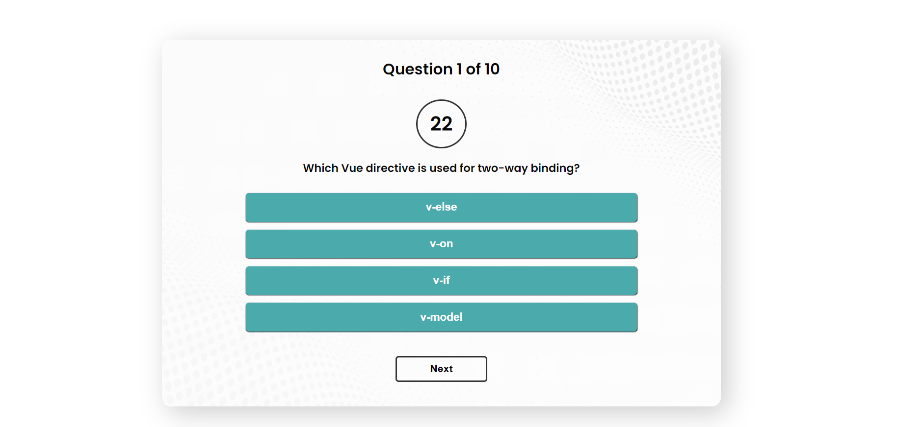

# Vue Quiz App



Quiz App Vue is a simple quiz application built with Vue.js. The application presents users with questions and four answer options. Users have 30 seconds to select an answer for each question. If the answer is not selected within the time limit, points will be deducted. At the end of the quiz, the total score will be displayed.

## Project Setup

To set up the Quiz App Vue project, follow these steps:

1. Clone the repository or download the source code as a ZIP file and extract it.

   ```shell
   git clone https://github.com/your-username/quiz-app-vue.git
   ```

2. Navigate to the project's directory.

   ```shell
   cd quiz-app-vue
   ```

3. Install the dependencies using npm.

   ```shell
   npm install
   ```

4. Once the dependencies are installed, you can compile and run the application in development mode using the following command:

   ```shell
   npm run serve
   ```

5. The application should now be running locally on `http://localhost:8080`. Open your web browser and navigate to this URL to access the Quiz App Vue.

## Available Commands

The following commands are available in the Quiz App Vue project:

- `npm run serve`: Compiles and hot-reloads the application for development.
- `npm run build`: Compiles and minifies the application for production.
- `npm run lint`: Lints and fixes files in the project.

For more information about customizing the configuration, please refer to the [Configuration Reference](https://cli.vuejs.org/config/) in the Vue CLI documentation.

## Conclusion

Congratulations! You have successfully set up the Quiz App Vue project. Feel free to explore the application, take quizzes, and customize it further according to your needs. If you have any questions or encounter any issues, please refer to the project's documentation or seek assistance from the project's maintainers. Enjoy your quiz-taking experience with Quiz App Vue!
